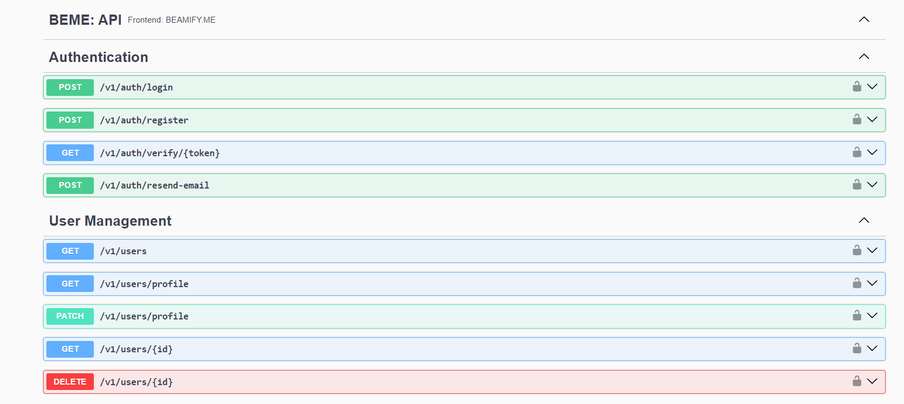

# BEME - Beamify Project Monorepo
This is the monorepo for the Beamify project. It contains all the code for the project.

## Project Structure
```angular2html
|-- beme
|--|-- api
|--|-- apps
|--|--|-- discord
|--|--|-- desktop
|--|-- frontends
|--|--|-- portal
|--|-- functions
|--|--|-- swagger.function
```
The API folder contains all the code for the API.   
The Apps folder contains all the code for the apps.   
The Frontends folder contains all the code for the frontends.   
The Functions folder contains all the code for the functions.  

Apps are 'Services' provided within the Beamify ecosystem.   
Frontends are the user interfaces for the portal, which grants access to the apps.   

### Api:
#### Swagger endpoint: http://localhost:3021/v1


### Apps:
#### Desktop:
build:
```shell
nx build desktop  
```
serve:
```shell
nx serve desktop  
```
make
```shell
nx run desktop:make --options
```
